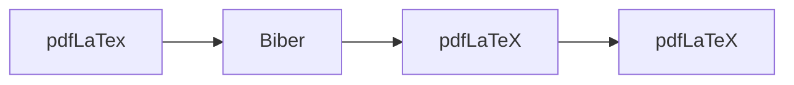

--- 
name: Compile BibLaTeX
tags: [LaTeX, Perl]
---

# Compile LaTeX documents using BibLaTeX

Below is an example of a LaTeX document that uses BibLaTeX for bibliographies:
```latex=
\documentclass{article}

\usepackage{biblatex}
\addbibresource{sample-references.bib}

\begin{document}
...
\printbibliography
\end{document}
```

The standard [compilation steps](https://en.wikibooks.org/wiki/LaTeX/Bibliographies_with_biblatex_and_biber) for creating the bibliography can be as follows:



The above procedure can be rather [tedious](https://tex.stackexchange.com/questions/248530/how-sensible-is-it-to-use-latexmk), so an alternative approach is to use the Perl script [latexmk](https://ctan.org/pkg/latexmk/).

Note that if you are using [MikTeX](https://miktex.org/) on Windows, you need to first install Perl (e.g., [Strawberryperl](https://strawberryperl.com/)) and manually add the `latexmk` program to the processing tool list, as shown below:
1. Add ("+") program to processing tools
    - https://figshare.com/ndownloader/files/65526486/preview/65526486/preview.jpg
2. Configure `latexmk`
    - https://figshare.com/ndownloader/files/65526489/preview/65526489/preview.jpg

